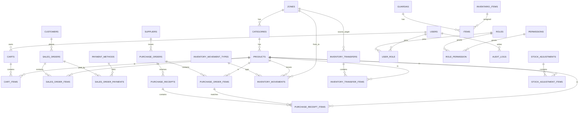

# Sistema de Gestión de Tienda (Laravel)

Documentación única y unificada del proyecto.

## 1. Resumen
Aplicación web con dos caras:
1. Tienda online (clientes): catálogo, carrito, checkout, cuenta y pedidos.
2. Administración (backoffice): productos, categorías, zonas, proveedores, usuarios y guardias.

El objetivo es publicar productos, gestionar stock y procesar pedidos con un flujo de compra completo.
Además, el proyecto ya incluye modelos y migraciones para inventario, compras y trazabilidad.

## 2. Stack tecnológico
- Backend: Laravel 12 (PHP 8.2+)
- Frontend: Blade
- Estilos y assets: Vite + Tailwind CSS v4
- Base de datos: MySQL
- Assets: Vite / npm

## 3. Instalación y arranque (local)
1. Instalar dependencias:
```bash
composer install
npm install
```

2. Configurar entorno:
```bash
cp .env.example .env
php artisan key:generate
```

3. Migraciones y datos:
```bash
php artisan migrate
php artisan db:seed
```

4. Assets:
```bash
npm run dev
# o
npm run build
```

5. Levantar servidor:
```bash
php artisan serve
```

Acceso local: `http://localhost:8000`

## 4. Docker (local)
Si usas docker-compose, el panel corre en:
- `http://localhost:8080`

Comandos típicos:
```bash
docker compose up -d --build
docker compose exec app php artisan migrate --seed
```

## 5. Credenciales admin (seed)
Se crean con `php artisan migrate --seed` o `php artisan db:seed`.

Super Admin:
- Email: `superadmin@tienda.local`
- Contraseña: `password`

Admin:
- Email: `admin@tienda.local`
- Contraseña: `password`


Atajos útiles:
```bash
composer run setup
composer run dev
composer run test
```
`composer run dev` levanta servidor, cola, logs y Vite en paralelo.
URL de login admin:
- `http://localhost:8080/admin/login` (Docker)
- `http://localhost:8000/admin/login` (local)

## 6. Módulos principales
### Administración
- Dashboard: estadísticas de productos, categorías y zonas
- Productos: CRUD completo, stock y estados
- Categorías: CRUD y relación con zonas
- Guardias: alta, baja lógica, reactivación y asignación de items

### Inventario y compras (base de datos y modelos)
- Órdenes de compra, recepciones y detalle de items
- Movimientos de inventario y tipos de movimiento
- Transferencias entre zonas y sus items
- Ajustes de stock con aprobación
- Relación proveedores-productos
- Zonas: CRUD y relación con categorías
- Proveedores: CRUD completo
- Usuarios: solo Super Admin

### Tienda
- Home con productos destacados
- Catálogo con filtros y búsqueda
- Detalle de producto con relacionados
- Carrito (actualización de cantidades)
- Checkout con validación de stock
- Cuenta del cliente (perfil y pedidos)

## 7. Roles y seguridad
Roles principales:
- `super_admin`: acceso total, puede gestionar usuarios
El admin se protege con middleware y validación de rol en login.
Permisos y roles se gestionan con pivots `role_permission` y `user_role`.
- `customer`: tienda y cuenta

El admin se protege con middleware y validación de rol en login.

## 8. Flujo de compra (resumen)
1. Cliente agrega productos al carrito
2. Checkout valida stock
SalesOrder 1..N SalesOrderPayment
PaymentMethod 1..N SalesOrderPayment
3. Captura dirección de envío
Role N..N Permission
Supplier N..N Product (via supplier_products)
PurchaseOrder 1..N PurchaseOrderItem
PurchaseOrder 1..N PurchaseReceipt
PurchaseReceipt 1..N PurchaseReceiptItem
InventoryMovementType 1..N InventoryMovement
InventoryTransfer 1..N InventoryTransferItem
StockAdjustment 1..N StockAdjustmentItem
Guardia 1..N Item
InventarioItem 1..N Item
4. Pago simulado (PaymentService)
5. Se crea pedido y se descuenta stock
## 10. Diagrama de base de datos (Mermaid)

6. Confirmación y pedidos en “Mi cuenta”
## 11. Endpoints principales
Nota: IVA configurado al 15% (Ecuador).

## 9. Estructura de datos (relaciones clave)
```
Zone 1..N Category
- `GET /tienda/api/carrito`
Category 1..N Product
Cart 1..N CartItem
SalesOrder 1..N SalesOrderItem
User N..N Role
Supplier 1..N PurchaseOrder
```

## 10. Endpoints principales
- `GET /admin/guardias`
- `POST /admin/guardias/{guardia}/items`
- `PATCH /admin/guardias/{id}/reactivar`
- `DELETE /admin/guardia-items/{id}`
Tienda:
## 12. Documentación adicional
- Ver [GUIA_INTEGRACION_GUARDIAS.md](GUIA_INTEGRACION_GUARDIAS.md) para el módulo de guardias. //ya está integrado, ya se eliminó el .md

## 13. Troubleshooting
- `GET /tienda/catalogo`
- `GET /tienda/producto/{product}`
- `GET /tienda/carrito`

Admin:
- `GET /admin/dashboard`
- `GET /admin/productos`
- `GET /admin/categorias`
## 14. Demo rápida
- `GET /admin/proveedores`
- `GET /admin/usuarios` (solo Super Admin)

## 11. Troubleshooting
Página en blanco / errores raros:
## 15. Roadmap sugerido
php artisan optimize:clear
php artisan cache:clear
php artisan config:clear
php artisan view:clear
```

Assets sin estilos:
```bash
npm run build
```

Reset contraseña (admin):
```bash
php artisan tinker
$user = \App\Models\User::where('email', 'superadmin@tienda.local')->first();
$user->update(['password' => \Illuminate\Support\Facades\Hash::make('newpassword')]);
```

## 12. Demo rápida
1. Entra al admin y crea zona → categoría → producto
2. Abre la tienda y agrega al carrito
3. Completa checkout
4. Revisa pedido en “Mi cuenta”

## 13. Roadmap sugerido
- Pasarela de pagos real (Stripe/PayPal)
- Reportes de ventas e inventario
- Auditoría y logs por acción
- Exportación a Excel/PDF

